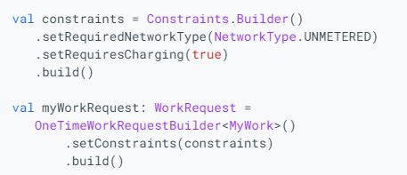

# UI LAYER LIBRARIES
## View binding
Là tính năng giúp giao tiếp với View dễ dàng.
Tự động tạo class binding cho mỗi XML layout file. Và mỗi instance của class thì trỏ thẳng đến toàn bộ các view đã được khai báo Id của mỗi file XML.
Usecase: Dùng để thay thế findViewById. Thay vì phải khai báo từng biến cho mỗi view thì chỉ cần một class View Binding thì có thể truy cập đến tất cả các view có trong file XML.
-	Different configurations: Nếu sử dụng các config khác nhau thì khi generate thay vì generate ra type của widget đó thì nó sẽ trả về View. 
	-	Workaround: Chỉ định viewBindingType cho nó:

	-	Trường hợp xử dụng subclass:

### Sự khác nhau khi so với `findViewById`
-	Null safety: Không bị lỗi `null pointer exception` bị throw với invalid Id. Khi sử dụng nhiều config thì các view phụ thuộc vào config được đánh dấu `@nullable`.
-	Type safety: Không bị lỗi khi cast class bởi vì mỗi trường của class binding có type giống với view tương ứng trong file XML
=> Nếu bị lỗi khi build thì sẽ bị lúc compile time chứ không phải runtime
### Sự khác nhau so với dataBinding
-	Ưu điểm: biên dịch nhanh hơn, dễ sử dụng.
-	Nhược: Không hỗ trợ “Layout variables hoặc layout expression => Không khai báo giao diện động từ XML file. Không hỗ trợ “two-way data binding"
## DataBinding
Tính năng như view binding như sẽ bind dữ liệu vào file XML. Muốn dùng thì phải bọc biến trong syntax `@{}`:

# DATA LAYER LIBRARIES
## DataStore

-	Synchoronus API: Datastore không hỗ trợ, SP có hỗ trợ nhưng không an toàn khi call bởi UI thread bởi có thể gặp lỗi khi UI bị destroy
-	Safe to call on UI thread: Datastore an toàn khi được gọi trên UI thread gởi nó sẽ chạy trên luồng Dispatchers.IO
-	Can signal errors: Trong khi SP không có API để bắt lỗi error thì DataStore có.
-	Safe from runtime exception: Vì có cơ chế bắt lỗi và được chạy dưới luồng IO nên DS an toàn khỏi runtime-exception
-	Has a transactional API with strong consistency guarantees: DS sẽ trả data về dưới dạng Flow => hỗ trợ nhiều api để modify data
-	Handles data migration: DS có hỗ trợ migration từ SharedPreference
-	Type safety: Riêng với datastore Proto thì có hỗ trợ type safety bằng cách define các trường dữ liệu trước trong file proto
## WorkManager
Là API giúp lập lịch task bất đồng bộ kể cả khi app exit hoặc thiết bị khởi động lại.
Cách WorkManager sử dụng dịch vụ lập lịch:

### Ràng buộc
WM có cung cấp API để ràng buộc các điều kiện tối ưu cho công việc. Ví dụ như chỉ chạy task khi device kết nối mạng, hay chỉ chạy task khi “device is idle”, …

### Robust scheduling
WM cho phép lập lịch các task chạy một lần hoặc lặp lại nhiều lần.

Task có thể được đặt “tag” hoặc “name” => cho phép định danh các task, thay thế task hoặc hủy bỏ tập hợp các task cùng một lúc.

Các task đã lên lịch được lưu trữ trong cơ sở dữ liệu SQL lite => WM đảm bảo rằng các công việc vẫn được thực thi kể cả khi thiết bị được khởi động lại.
### Flexible Retry Policy

Trong lúc thực thi, nếu chúng ta catch được error thì thay thì trả về Result.failed() thì chúng ta có thể trả về Result.retry(). Khi đó task sẽ được lập lịch lại dưa theo “backoff delay” và “backoff policy”
-	Backoff delay: Là khoảng thời gian tối thiểu để retry sau khi task đó được trả về Result.retry() lần đầu tiên. Giá trị tối thiểu: 10 giây
-	Backoff policy: định nghĩa thời gian retry dựa trên “backoff delay” sau mỗi lần retry. Nếu set “LINEAR” thì sau mỗi lần retry sẽ tăng delay một lần: 10s -> 20s  -> 30s -> 40s -> … Nếu set “EXPONENTIAL” sẽ tăng delay theo cấp số nhân: 10s -> 20s -> 40s -> 80s -> …
### Truyền, xuất data cho task
WM cho phép truyền xuất data cho task thông qua các API: setInputData, outputData

Các data truyền vào, xuất ra định danh theo “key: value”

Các type có thể truyền xuất: [Data.Builder | Android Developers](https://developer.android.com/reference/androidx/work/Data.Builder)
### Workchaning
Các task có thể xâu thành một chuỗi tuần tự với nhau, không những thế WM còn cung cấp API cho chúng ta cho phép các task nào chạy tuần tự, các task nào chạy song song.

Với mỗi task, có thể định danh input, output cho task đó và đến khi thực hiện task tiếp theo thì WM sẽ tự động truyền input vào.
