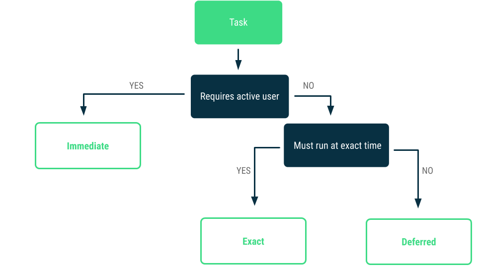
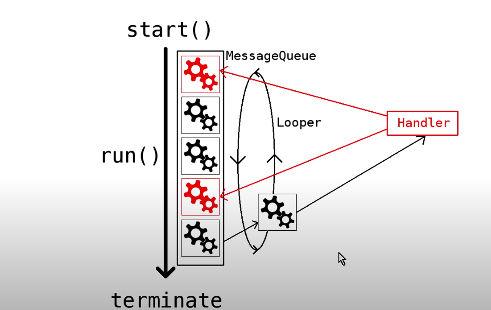
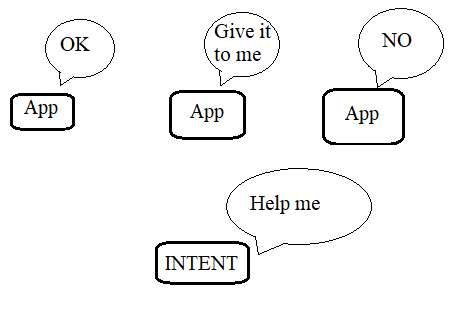

# TỔNG QUAN
## Nguyên tắc:
Mọi task mà cần nhiều hơn milliseconds để xử lý thì nên được xử lý dưới luồng backgroud như là: decode bitmap, truy cập bộ nhớ, làm việc trên một Machine Learning Model hay xử lý các tác vụ mạng.
## Định nghĩa background work:
Một app được coi là đang chạy nền khi một trong các điều kiện trên được thỏa mãn:
-	Không có một acitivity nào của app được nhìn thấy bởi user.
-	App không chạy một “foreground services” đã bắt đầu trước đó trong khi một activity của app được nhìn thấy bởi user. Foreground service là các hoạt động mà người dùng có thể nhìn thấy khi sử dụng app.
Note: Đôi lúc, sau khi một “foreground service” bắt đầu trong khi activity visible for user, sau đó user điều hướng ra khỏi app như trở về homescreen. Lúc này, app được coi là đang chạy trong foreground kể cả khi người dùng thoát khỏi app.
## Phân loại background task:
Background task bao gồm các loại chính:
-	Immediate
-	Deferred
-	Exact

## Các giải pháp
-	Immediate task:
	-	Sử dụng "kotlin coroutine" để thực hiện các immediate task – task mà kết thúc khi người dùng rời khỏi một “scope” nhất định nào đó hoặc hoàn thành một tương tác nào đó.
	-	Có thể sử dụng "Thread" cho java
	-	Đối với những task cần thực thi ngay lập tức và tiếp tục thực thi cho đến khi task hoàn thành kể cả khi người dùng tắt app hoặc thiết bị khởi động lại thì nên sử dụng WorkManager
-	Defferd task: WorkManager.
-	Exact task: Alarm Manager.
# LUỒNG BACKGROUND
## Thread pool:
Thread pool là tập hợp các luồng được quản lý để chạy các task song song với nhau từ hàng đợi.
Thread pool giải quyết được 2 vấn đề:
	-	Cải thiện hiệu suất khi thực hiện một số lượng lớn các task không đồng bộ nhờ có thể chạy song song các tác vụ.
	-	Cung cấp phương tiện dùng để ràng buộc các tài nguyên bao gồm luồng, sự tiêu thụ tài nguyên khi thực hiện một nhóm các task.
### Core and maximum pool size:
Thead pool sẽ tự động điều chỉnh kích thước của nó, đồng thời cung cấp các API để theo dõi, điều chỉnh kích thước như: getPoolSize(), getCorePoolSize(), getMaximumPoolSize(), ...
### On-demand construction:
Mặc định core threads được tạo ra và bắt đầu chỉ khi nào có task mới được thực thi. Nhưng nó có thể thay đổi bằng cách overriden phương thức: prestartCoreThread(), prestartAllCoreThread().
### Creating new threads:
-	Mặc định, thread mới được tạo ra bởi “ThreadFactory” có cùng “Thread Group”, độ ưu tiên “NORM_PRIORITY” và non-daemon status.
Có thể tùy chỉnh ThreadFactory để định danh: thread’s name, thread group, priority, daemon status, …
-	Nếu “ThreadFactory” ko thể tạo một thread khi nhận được giá trị null từ “newThread”, the executor vẫn tiếp tục nhưng có thể không thực thi được bất kỳ task nào.
-	Thread cần sỡ hữu “RuntimePermission”. Nếu mà thread không có quyền này thì khi được sử dụng bởi ThreadPool thì dịch vụ có thể bị xuống cấp, các sự thay đổi của config ko có tác dụng đúng thời điểm, và pool có thể đi vào trạng thái kết thúc nhưng task chưa hoàn thành.
### Keep-alive time:
Nếu pool hiện tại có nhiều thread hơn “corePoolSize” thì thread sẽ bị kill nếu nó đang trong trạng thái không hoạt động hoặc quá “keepAliveTime”.
=> Giảm tiêu thụ tài nguyên khi các thread không hoạt động.
### Queuing:
-	Nếu hiện tại có ít luồng hơn “corePoolSize” đang chạy thì Excutor luôn ưu tiên tạo mới một thread hơn là cho task vào hàng đợi
- Nếu hiện tại có nhiều luồng hơn “corePoolSize” đang chạy thì Excutor ưu tiên cho task vào hàng đợi hơn là tạo một thread mới.
-	Nếu task không thể đưa vào hàng đợi thì một thread mới sẽ được tạo trừ khi vượt quá “maximumPoolSize”, lúc đó task sẽ bị từ chối.
Có 3 chiến lược cho hàng đợi:
-	Direct handoffs: Đưa task cho luồng mà không giữ chúng. Khi đó, cho task vào hàng đợi sẽ fail khi không có thread nào sẵn sàng để thực thi => một thread mới sẽ được tạo ra.
-	Unbounded queues: Sử dụng một hàng đợi không giới hạn => task mới sẽ phải đợi trong hàng đợi cho đến khi có thread được free để thực thi. Do đó sẽ không có luồng mới nào được tạo ra.
-	Bounded queues: Sử dụng một hàng đợi giới hạn hạn chế việc cạn kiệt tài nguyên nhưng lại khó để điều chỉnh và kiểm soát.
### Rejected task:
Task sẽ bị từ chối nếu excutor bị “shutdown” hoặc khi excutor sử dụng hàng đợi giới hạn và số lượng luồng và size của hàng đợi đó đã là tối da.
### Hook method:
Cung cấp API để thực thi các lệnh trước và sau khi các task được thực thi: beforeExcecute(), afterExecute().
### Queue maintenance:
-	Có cung cấp API để theo dõi và debug hàng đợi khi cần: getQueue().
-	Có cung cấp API để loại bỏ các task trong hàng đợi: remove(), purge()
### Finalizations:
Một pool không còn tham chiếu trong app và không còn luồng nào đang hoạt động thì sẽ bị ngưng hoạt động tự động.
## Handler
Sử dụng Handler để define “Thread” và có thể run task cho thread mà mình mong muốn.

# TỐI  ƯU HÓA BACKGROUND
## Restrictions on receiving network activity broadcasts
App với target API 24 không nhận “CONNECTIVITY_ACTION” broadcasts nếu được khởi tạo trong manifest và quy trình của broadcast này sẽ không được bắt đầu.
Ràng buộc cho task chỉ thực thi khi kết nối với mạng không giới hạn dung lượng.
Quan sát kết nối mạng.
## Restrictions on receiving image and video broadcasts:
App với target API 24 không thể gởi và nhận “ACTION_NEW_PICTURE” hay “ACTION_NEW_VIDEO”.
-	Trigger jobs on content URI changes.
-	Determine which content authorities triggered a job
# ALARM MANAGER
Dùng để chạy các tác vụ trong tương lai, có thể chạy khi không ở trong vòng đời của application. Giống như tên, chức năng nó giống như một đồng hồ báo thức: trigger task chạy chính xác khoảng thời gian mình đặt trước, và có thể lặp lại.
Alarm type:
-	Elapsed real time: Thời gian dựa trên thời gian khởi động hệ thống.
-	Real time clock: Thời gian dựa trên múi giờ địa điểm.

|  | Coroutine | AlarmManager | WorkManager |
|:--:|:--:|:--:|:--:|
| **Run in background thread** | x | x | x |
| **Run when app has terminated, device restart** |  | x | x |
| **Need / can run intermediate** | x |  | x |
| **Need run at exact time** |  | x |  |
| **Suitable for** | Intermediate task | Exact task | Intermediate, Deferred task |
| **Reason** | Task executed in background thread via dispatcher => no block main thread (UI) | Execute tasks at exact time and even the app is terminated / device restart | Set constrains for executing tasks in the background thread & even the app is terminated / device restart |
# INTENT
## What
Intent là một message object được dùng để request một action từ các component khác trong/ ngoài app
Thường được dùng để: start an activity, start a service, delivery a broadcast
Intent chia làm 2 loại:
-	Tường minh: intent được define các thành phần tham gia

-	Bất tường minh: intent không chỉ rõ mục tiêu thành phần, nhưng có đầy đủ thông tin để hệ thống có thể xác định các thành phần có sẵn để chạy cho mục đích của intent

Một vài thành phần của Intent:
-	Component name: Tên của component mục tiêu
-	Action: String
-	Data: dữ liệu kèm theo có dạng Uri
-	Category: bổ sung thông tin cho intent về component xử lý intent
-	Extra: cặp dữ liệu key-value

### Intent Filter
Intent filters is use for defining which implicit intents your app can receive. Each intent filter specifies the type of intents it accepts based on the intent's action, data, and category. The system delivers an implicit intent to your app component only if the intent can pass through one of your intent filters.
**Note:**  An explicit intent is always delivered to its target, regardless of any intent filters the component declares.
Each intent filter is defined by an `<intent-filter>` element in the app's manifest file, nested in the corresponding app component (such as an `<activity>` element).
Element of Intent Filter:
-	`<action>`: Declares the intent action accepted.
-	`<data>`: Declares the type of data accepted.
-	`<category>`: Declares the intent category accepted
**Note:**  To receive implicit intents, you  _must include_  the  `[CATEGORY_DEFAULT]`  category in the intent filter. The methods  `[startActivity()]`  and  `[startActivityForResult()]`  treat all intents as if they declared the  `[CATEGORY_DEFAULT]`  category.

## Why
Giao tiếp truyền dữ liệu giữa các activity, service, broadcast
## How
