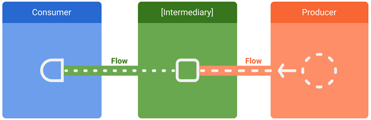

# LIVEDATA
## Định nghĩa 
Livedata là một class có thể quan sát được(observable) -> nó có thể được theo dõi bởi các component khác như activity, fragment, …

Livedata có “Lifecycle aware” => có thể gởi sự kiện thay đổi tới activity hay fragment mà không bị memory leaks
## Ưu điểm
-	Không bị memory leaks bởi có “Lifecycle aware”
-	Có thể chia sẻ tài nguyên: Một variable livedata có thể được quan sát bởi nhiều components
# Flow
## Định nghĩa
Flow là một luồng stream tuần tự của tập hợp các giá trị được xử lý bất đồng bộ. Flow sẽ emit giá trị mỗi khi nào giá trị đó được xử lý xong.

Flow là một luồng stream lạnh (cold stream) => nó sẽ bắt đầu xử lý và trả về value khi có một component khác bắt luồng stream. Khác với hot stream sẽ bắt đầu xử lý và trả về value ngay lập tức.
## Ưu điểm
-	Có thể modify stream:

-	Cung cấp các API để thực thi trong nhiều context khác nhau

**Flow thì liên tục “emit” kết quả còn LiveData sẽ update value khi nào tất cả dữ liệu đã được lấy và trả về tất cả dữ liệu trong 1 lần**