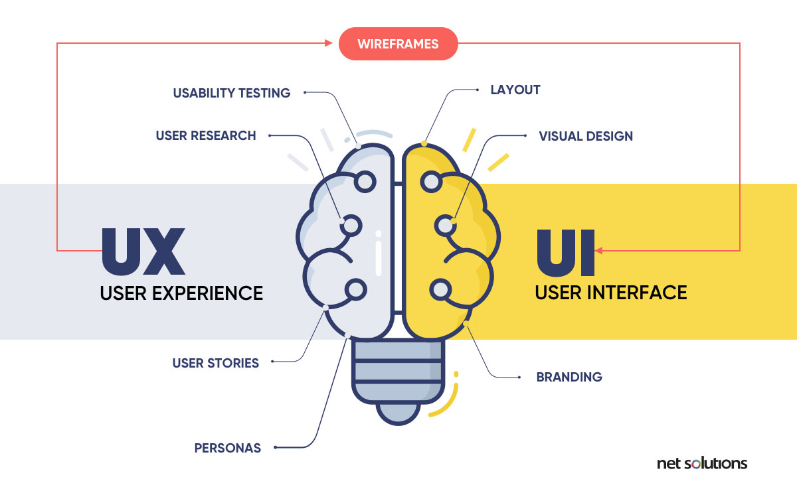
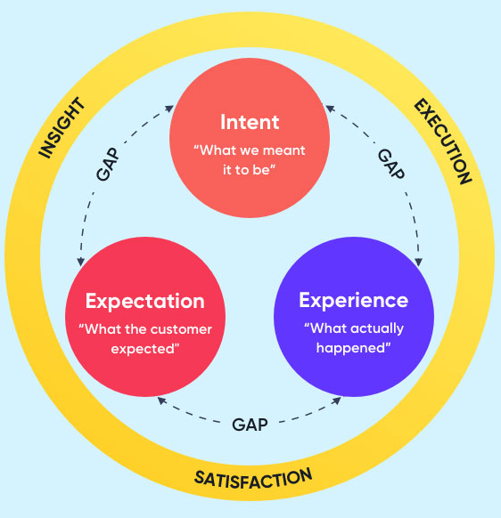

# Presentation Layer 
## What
The presentation layer consists of all the processes and components to deliver the app to the user. When building the presentation layer, developers are concerned with what the user sees and feels when using the app. In other terms, the presentation layer is made up of the user interface (UI) and user experience (UX).

### User interface design
The user interface (UI) refers to the look rather than the function of a website or product
UI design, refers to the process of designing a user interface (UI) that is aesthetically pleasing. The best UI designs will go even further, delighting users with a design that exceeds their expectations.
#### Type of common UI design:
- Graphic user interface (GUI): The GUI is the most common and familiar type of interface, one which allows users to interact with icons or other graphical elements on all kinds of devices. Where haptics are involved in a touchpad or touchscreen display, the UI is referred to as a touchscreen GUI.
- Voice user interface (VUI): A voice user interface provides output by voice prompts (text to speech) and accepts both voice (speech recognition) and typed input. Many devices now support voice commands for accessibility, convenience, and personalization. VUI can be built as an alternate option within a GUI (e.g. search fields that accept speech-to-text) or as a separate voice app or product.
- Command line interface (CLI): This text-based interface allows users to type into the command line, a simple interface with low memory requirements. This interface requires users to have knowledge of command language.
#### Key of UI design:
- Clarity Clearly: communicate both the meaning and the function of the website or app, what it does, and how to navigate.
- Familiarity: Familiarity is something that is naturally understood.
- Consistency: consistency looks for uniformity across elements of the design, ensuring elements look or behave the same in each context.
- Forgiveness: A good interface incorporates the ‘what if’ scenarios, supporting users to undo mistakes, go ‘back’ to previous pages, providing detailed reporting to errors, or providing useful alternatives if search results are zero or they encounter a non-existent page.
- Efficiency: Allowing the user to do what they came to do with the least amount of work. Efficiency is created through good design as well as shortcuts
### User Experience design
User Experience encompasses all the customer interactions with the company and its product, app, or website => need asking at every stage what a user may want, need, and feel.

User experience design is about understanding how customers feel when they interact with a website, app, or product.
### Key of UX design:
- Is it useful? Does the app or website fulfill a customer’s want or need? Does it do so better than the competitors?
- Is it desirable? Is the experience aesthetically pleasing and to the point? This point focuses on branding over function.
- Is it findable? Is the site or service easy to find and use?
- Is it usable? How quickly and efficiently can someone do what they came to do? UX design will consider the number of clicks, server speed, and even the familiarity of the design.
- Is it accessible? Do all users experience the product / service in the same way?
- Is it credible? How do you demonstrate trust? Detailed, transparent information and social proof lend.
- Is it valuable? Customers prioritize different aspects of their experience over others, which is why value is at the center of the honeycomb, representing the ideal mix of all the other 6 variables.