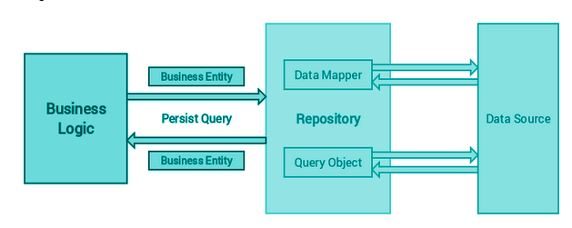

# What
## Context

In applications, directly accessing the data from data stores such as databases or Web services, etc can result: 

- Duplicated code
- A higher potential for programming errors
- Weak typing of the business data
- Difficulty in centralizing data-related policies such as caching
- An inability to easily test the business logic in isolation from external dependencies

## Solution
Use a repository to separate the logic that retrieves the data and parse it to the model from the business logic. 
Repositories are classes or components that encapsulate the logic required to access data sources. They centralize common data access functionality, providing better maintainability and decoupling the infrastructure or technology used to access databases from the domain model layer
Repository pattern is a kind of container where data access logic is stored. It hides the details of data access logic from business logic. In other words, we allow business logic to access the data object without having knowledge of underlying data access architecture.

## Compare to Legacy Data Access class (DAL class) pattern

|             |                          Repository Pattern                         |                 Legacy Data Access pattern                |
|:-----------:|:-------------------------------------------------------------------:|:---------------------------------------------------------:|
|     What    | Abstraction of a collection of objects                              | Abstraction of data persistence                           |
|    Focus    | Be considered closer to the Domain, dealing only in Aggregate Roots | Be considered closer to the database, often table-centric |
| Data's Type |                            Specific type                            |                     Result of queries                     |
|     Mode    |                              Read-only                              |                         Read-Write                        |
 
Note: **Aggregate** means collection of something
# Why
- Maximize the amount of code that can be tested with automation and to isolate the data layer to support unit testing.
- Access the data source from many locations and want to apply centrally managed, consistent access rules and logic.
- Implement and centralize a caching strategy for the data source.
- Improve the code's maintainability and readability by separating business logic from data or service access logic.
- Use business entities that are strongly typed so that can identify problems at compile time instead of at run time.
- Associate a behavior with the related data.
- Apply a domain model to simplify complex business logic.
# How