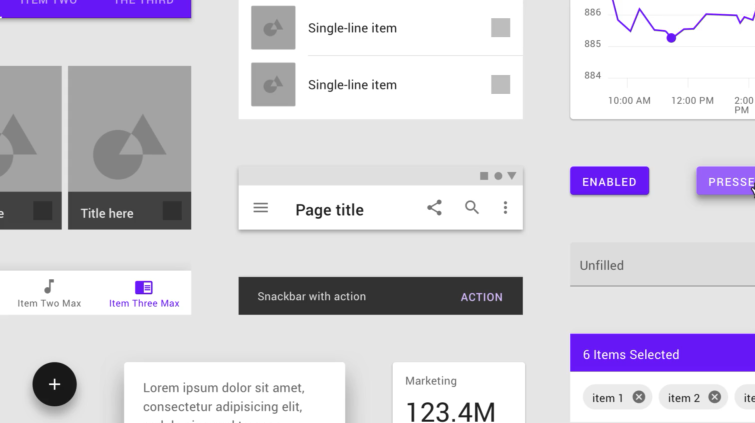

# What
A UI Design System is the single source of truth which groups all the elements that will allow the teams to design UI/UX of a product such as: font, color, images, button, ...

# Why
- Scale: Design (and development) work can be created and replicated quickly and at scale. The primary benefit of design systems is their ability to replicate designs quickly by utilizing premade UI components and elements.
- Consistency: Design systems provide a single source of components, patterns, and styles and unify disjointed experiences so that they are visually cohesive and appear to be part of the same ecosystem.
- Efficiency: 
- Teamwork: Especially when design responsibilities shift or when teams become geographically dispersed, a unified language reduces wasted design or development time around miscommunications. For example, the functionality or appearance of a dropdown menu would not be debated, since that term is reserved for a specifically defined element within the design system